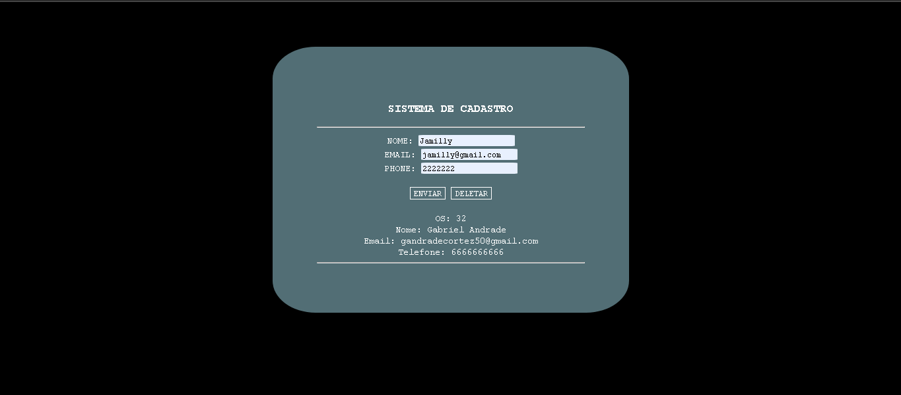

<h2>Sistema de cadastro</h2>
A simple registration system with PHP to practice my skills

<h2>Description</h2>

A registration system to practice my skills in procedural php, it is possible to insert and delete user data from a system shown on the screen through HTML

<h2>How it works?</h2>

<h3>Entering data into the system</h3>

<h3>Deleting this data from the system</h3>

